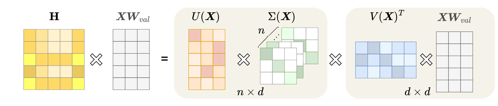

<div align=center>
<h1> Learning Advanced Self-Attention for Linear Transformers in the Singular Value Domain</h1>


 [](arxiv.org/abs/2505.08516)
 [](https://www.alphaxiv.org/abs/2505.08516) 
 [](https://www.ijcai.org/proceedings/2025/0730) 

<div>
      <a href="https://scholar.google.co.kr/citations?user=-foMLcAAAAAJ&hl=en" target="_blank"><b>Hyowon Wi</b></a><sup>1</sup>,
      <a href="https://www.jeongwhanchoi.com" target="_blank">Jeongwhan Choi</a><sup>1</sup>,
      <a href="https://sites.google.com/view/noseong" target="_blank">Noseong Park</a><sup>1</sup>,
    <div>
    <sup>1</sup>KAIST
    </div>
</div>
</div>

---

This is the official implementation of our IJCAI 2025 paper "Learning Advanced Self-Attention for Linear Transformers in the Singular Value Domain" (AGF).

## 📚 Related Works from Our Group

| Venue | Paper | Code |
|:-----:|:------|:----:|
| **NeurIPS 2024** | [Graph Convolutions Enrich the Self-attention in Transformers!](https://proceedings.neurips.cc/paper_files/paper/2024/hash/5eceb48c3bc8b5d936c05ff8e2ece65e-Abstract-Conference.html) | [](https://github.com/jeongwhanchoi/gfsa) |
| **ICML 2024** | [Polynomial-based Self-Attention for Table Representation Learning](https://proceedings.mlr.press/v235/kim24ae.html) | [](https://github.com/JayoungKim408/TabPSA) |
| **AAAI 2024** | [An Attentive Inductive Bias for Sequential Recommendation Beyond the Self-Attention](https://ojs.aaai.org/index.php/AAAI/article/view/28747) | [](https://github.com/yehjin-shin/BSARec) |
| **ICLR 2024** | [Learning Flexible Body Collision Dynamics with Hierarchical Contact Mesh Transformer](https://openreview.net/forum?id=90yw2uM6J5) | [](https://github.com/yuyudeep/hcmt) |

---

## 📌 TL;DR

We propose Attentive Graph Filter (AGF), a novel self-attention mechanism that interprets attention as learning graph filters in the singular value domain from the perspective of directed graph signal processing (GSP). AGF achieves linear complexity O(nd²) while effectively leveraging both low and high-frequency information, outperforming existing linear Transformers on various benchmarks.

## 🏗️ Method Overview

<div align="center">

</div>

### Key Insight: Self-Attention is a Low-Pass Filter

**Theorem 1.** Let $M = \text{softmax}(Z)$ for any matrix $Z \in \mathbb{R}^{n \times n}$. Then $M$ inherently acts as a low pass filter.

This means vanilla self-attention attenuates high-frequency information, limiting the expressive power of Transformers.

### Our Solution: Attentive Graph Filter (AGF)

AGF directly learns graph filters in the singular value domain:
$AGF(X) = U(X) Σ(X) V(X)^{T} XW_v$
where:
- $U(X) = \rho(XW_u) \in \mathbb{R}^{n \times d}$ (left singular vectors)
- $Σ(X) = \sum_ k θ_k T_k(\text{diag}(\sigma(XW_s))) \in \mathbb{R}^{n \times d \times d}$ (filtered singular values)
- $V(X)^{T} = \rho((XW_v)^T) \in \mathbb{R}^{d \times n}$ (right singular vectors)

**Theorem 2.** If the coefficient $\theta_k$ of a graph filter can have negative values and learned adaptively, the graph filter will pass low and high frequency signals appropriately.


---

## ⚙️ Installation & Quick Start

```bash
# Clone the repository
git clone https://github.com/hyowonwi/agf.git
cd agf
```

For detailed instructions on installation, dataset preparation, and running experiments, please refer to the README in each subdirectory:

| Task | Directory | README |
|:-----|:----------|:-------|
| **Long Range Arena (LRA)** | `AGF_LRA/` | [📖 AGF_LRA/README.md](AGF_LRA/README.md) |
| **UEA Time Series Classification** | `AGF_UEA/` | [📖 AGF_UEA/README.md](AGF_UEA/README.md) |

---

## 📝 Citation

If you find this work useful, please cite our paper:

```bibtex
@inproceedings{wi2025agf,
  title     = {Learning Advanced Self-Attention for Linear Transformers in the Singular Value Domain},
  author    = {Wi, Hyowon and Choi, Jeongwhan and Park, Noseong},
  booktitle = {Proceedings of the Thirty-Fourth International Joint Conference on
               Artificial Intelligence, {IJCAI-25}},
  publisher = {International Joint Conferences on Artificial Intelligence Organization},
  pages     = {6561--6569},
  year      = {2025},
  month     = {8},
  note      = {Main Track},
  doi       = {10.24963/ijcai.2025/730},
  url       = {https://doi.org/10.24963/ijcai.2025/730},
}
```

---

<div align="center">
<p>If you have any questions, please open an issue or contact us at <a href="mailto:hyowon.wi@kaist.ac.kr">hyowon.wi@kaist.ac.kr</a> or <a href="mailto:jeongwhan.choi@kaist.ac.kr">jeongwhan.choi@kaist.ac.kr</a></p>
<p>⭐ Star this repository if you find it helpful!</p>
</div>
